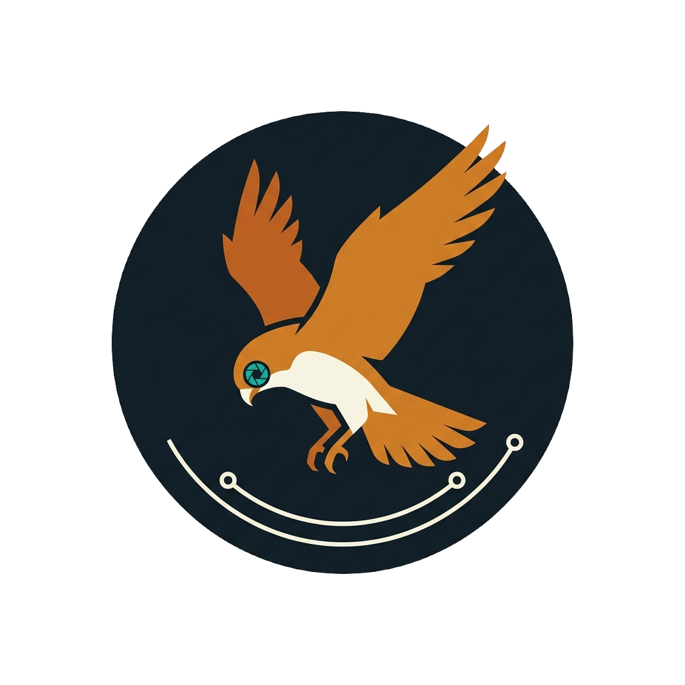

<p align="center">
  
</p>

# Kestrel
### Motion-Gated Object Detection on Arm Cortex-M: spend compute only when, and where, something moves

[](LICENSE)
[]()
[]()
[]()

> **A kestrel hovers motionless, watching, spending nothing, then strikes
> only when something moves, only where it moved.**
> Event-driven object detection on Arm Cortex-M. Smarter, not just faster.

**Reproducing or evaluating this project?** Start with
[`docs/troubleshooting.md`](docs/troubleshooting.md): every build, flash and
measurement gotcha we hit, and how to get past it in seconds.

---

## Overview

Most embedded vision systems run full neural network inference on every frame, every time,
regardless of whether anything in the scene has changed. On a monitoring scene that is static
95% of the time, that means ~95% of the inference compute, and the power it burns, is wasted
re-detecting a scene that hasn't moved.

Kestrel eliminates that waste with a three-level attention cascade, each level orders of
magnitude cheaper than the one it gates:

| Level | Runs on | Cost | Question it answers |
|---|---|---|---|
| 1. PIR sensor | RP2350 (Cortex-M33), H750 asleep | low-mA idle (target) | "Is anything happening at all?" |
| 2. Frame-difference gate | STM32H750 (Cortex-M7) | sub-millisecond | "Did the scene actually change?" |
| 3. INT8 detector (X-CUBE-AI runtime) | STM32H750 (Cortex-M7) | ~180 ms | "What is it, and where?" |

When the gate opens, Kestrel doesn't just run the detector; it **crops the model's input to
the region that moved**. Because the model input resolution is fixed, this costs nothing extra,
and it acts as a digital zoom: a distant person who would occupy 8 pixels in a full-frame
downscale occupies 40+ pixels in a motion-centered crop, dramatically improving small-object
detection at identical inference cost.

### What makes it interesting

The standard approach to embedded AI optimization focuses on the model: quantize it, prune it,
shrink it. Those techniques are necessary; Kestrel applies them, but they optimize the cost
of *one inference*. Kestrel optimizes the *system*: it asks "should we even run inference right
now, and on which pixels?" On scenes with intermittent motion, average compute scales with the
**activity of the scene** rather than the frame rate, a reduction no amount of model
compression can reach on its own, with zero accuracy loss, because active frames still get
full inference.

### Why it should win

- **Motion-gated inference with ROI attention** has been described in research since 2017
  (Fast YOLO, arXiv:1709.05943; AmphibianDetector, arXiv:2011.07513), but we found no public
  bare-metal Cortex-M implementation (as of July 2026); it is absent from ST's FP-AI-VISION1
  function pack, X-CUBE-AI documentation, and published STM32 vision tutorials. Kestrel ships
  it as [`modules/motion_gate/`](modules/motion_gate/), a dependency-free, drop-in C module
  for any Arm Cortex-M camera pipeline, with host-runnable tests.
- **The RP2350 hardware interpolator characterized for ML preprocessing**: the INTERP unit is
  documented for graphics use (RP2350 datasheet §3.1.10), but we found no published use in an
  ML preprocessing pipeline. Kestrel contributes the first benchmark of hardware-assisted
  bilinear resize for model input preparation on this chip, as a standalone reusable artifact
  for the growing class of RP2350-hosted camera projects. Measured on silicon, the verdict
  is honestly negative on speed (bit-exact but 0.90×; -O2 ALU wins) and positive on insight:
  it surfaced an undocumented-in-practice lane 1 alpha-masking gotcha that silently degrades
  blend mode to nearest-neighbor.
- **Honest, reproducible measurement.** Every number in this README is (or will be, before
  submission) a DWT cycle-counter or ammeter measurement, logged to CSV in
  [`benchmarks/`](benchmarks/), with the exact harness code included. No projected numbers.

### Physical AI track fit

Kestrel is a complete **sense → decide → act** loop under real power constraints:

| Track pillar | Where Kestrel delivers it |
|---|---|
| Deterministic real-time performance | Bare-metal, no OS, no scheduler jitter; fixed-cost gate and inference paths; we report **p95 latencies**, not just averages |
| Efficient, scalable compute | Three-level attention cascade, each watcher orders of magnitude cheaper than the next; average compute scales with scene activity |
| Heterogeneous workloads | Cortex-M7 runs perception/inference; dual Cortex-M33 handles the always-on sensing and motor control, each core class doing what it's most efficient at |
| Reliability | Gate failure mode is fail-open (unrecognized states run full inference); PIR provides an inference-independent wake path |

---

## Measurement Methodology: A Note on Honesty

Core numbers are now **measured on hardware** (July 13); remaining **[TBM]** markers are
pending only the RP2350 cascade wiring and its bench. As a cross-check against published
references: ST's model zoo lists the deployed model (st_yololcv1 192×192 INT8, COCO person;
see [`training/README.md`](training/README.md)) at 179ms on an STM32H747 @ 400MHz; we measure
**180ms on the H750 @ 480MHz executing from QSPI flash**, the same ballpark, with the QSPI
execute-in-place overhead offsetting the clock advantage. The measured gate check (173µs) is
**~1,000× cheaper than one inference**, so every gated frame recovers three orders of
magnitude of compute.

**Instruments:** Cortex-M7 DWT cycle counter for all on-device timing (cycle-exact at
480MHz). Current: **FNIRSI FNB-C2 inline USB meter**, 20-bit ADC, 1µA display resolution,
manufacturer-published accuracy **±0.05% + 2 counts** (we treat it conservatively as
better-than-±1% class; our power claims are 1.3×–3.0× ratios, far above any plausible
instrument error). We do not use Arm Performix here: Performix targets Arm64 Linux systems
(Neoverse/cloud) and cannot attach to bare-metal Cortex-M. For this class of device, cycle
counters and ammeters are the correct instruments.

---

## Hardware

| Component | Spec | Role |
|---|---|---|
| WeAct Studio STM32H750VBT6 | Cortex-M7 @ 480MHz, 1MB SRAM, 8MB QSPI flash | Main inference engine |
| OV2640 camera (onboard) | DCMI interface | Live image capture |
| 0.96" ST7735 TFT (onboard, 160×80) | SPI | Bounding box + gate status display |
| RP2350-USB Mini (16MB flash) | Dual Cortex-M33 @ 150MHz, 520KB SRAM | Always-on pre-screen + output controller |
| PIR sensor HC-SR501 | 3–7m range | Level-1 motion pre-screen |
| Servo motor SG90 | 180° | Physical response to detection |

**Wiring (H750 ↔ RP2350-USB Mini):**

```
STM32H750  PA9  (UART1 TX)  ──────▶  RP2350 GP1  (UART0 RX)
STM32H750  PA10 (UART1 RX)  ◀──────  RP2350 GP0  (UART0 TX)
STM32H750  PC0  (EXTI wake) ◀──────  RP2350 GP15 (GPIO OUT)
STM32H750  GND              ─────┬─  RP2350 GND
                                 └─  PIR GND
PIR        OUT              ──────▶  RP2350 GP14 (IRQ)
RP2350     GP2              ──────▶  Servo signal
```

Pin choices are constrained by the mini board's breakout (GP16–19 are not
exposed): see [docs/hardware/rp2350-usb-mini-pinout.jpg](docs/hardware/rp2350-usb-mini-pinout.jpg).

---

## System Architecture

```
╔══════════════════════════════════════════════════════════════════════╗
║  RP2350-USB Mini  (Always-on, Cortex-M33 @ 150MHz)                  ║
║                                                                      ║
║  Core 0:  PIR sensor ──▶ EXTI ──▶ GPIO HIGH ──▶ Wake H750           ║
║      Cascade idle current: [TBM, needs Stage 3]  (H750 always-on: 243mA measured)
║                                                                      ║
║  Core 1:  UART RX ──▶ parse detection event ──▶ drive servo/LED     ║
╚══════════════════════════╦═══════════════════════════════════════════╝
                           ║ GPIO wake pulse
╔══════════════════════════▼═══════════════════════════════════════════╗
║  STM32H750  (Cortex-M7 @ 480MHz, 1MB SRAM)                           ║
║                                                                      ║
║  OV2640 ──DCMI+DMA──▶ Frame Buffer (160×120 RGB565)                  ║
║                └──▶ grayscale convert ──▶ 160×120 ×8bit (~19KB)      ║
║                                                                      ║
║  ┌──────────────────────────────────────────────────────────────┐   ║
║  │  GATE STAGE  (0.5 ms meas.)                                  │   ║
║  │                                                              │   ║
║  │  Abs diff: current grayscale frame vs previous               │   ║
║  │  Changed-pixel count ──▶ threshold check                     │   ║
║  │                                                              │   ║
║  │  No significant change? ──▶ keep last result, back to        │   ║
║  │                             STOP mode. Inference skipped.    │   ║
║  │                                                              │   ║
║  │  Change detected? ──▶ bounding box of changed region         │   ║
║  │                       (the "attention ROI")                  │   ║
║  └────────────────────────────┬─────────────────────────────────┘   ║
║                               │ attention ROI                        ║
║  ┌────────────────────────────▼─────────────────────────────────┐   ║
║  │  INFERENCE STAGE  (fixed cost per invocation)                │   ║
║  │                                                              │   ║
║  │  Crop ROI (padded to square) ──▶ resize to 192×192 input     │   ║
║  │    → same inference cost as full frame, but the moving       │   ║
║  │      object fills the model's field of view (digital zoom)   │   ║
║  │  INT8 detector, X-CUBE-AI runtime (M7 kernels)               │   ║
║  │  Weights: QSPI flash (XIP)   Activations: AXI SRAM           │   ║
║  │  Per-inference latency: 180 ms measured, ±1 ms               │   ║
║  └────────────────────────────┬─────────────────────────────────┘   ║
║                               │                                      ║
║  NMS ──▶ coords mapped ROI→frame ──▶ TFT (boxes + gate HUD)          ║
║      └──▶ UART TX ──▶ RP2350 Core 1 (detection event)                ║
║                                                                      ║
║  Saves grayscale frame for next diff, returns to STOP mode           ║
╚══════════════════════════════════════════════════════════════════════╝
```

**Where the savings come from (and where they don't):** the model input is a fixed 192×192
tensor, so a single inference always costs the same; cropping does *not* make inference
faster. The compute savings come entirely from the **gate skipping inference on unchanged
frames** and the **PIR cascade letting the H750 sleep**. The ROI crop is an *accuracy*
optimization at equal cost. (A planned extension, a "resolution ladder" of 192/128/96 model
variants dispatched by ROI size, would make inference cost genuinely scale with motion area;
see [Roadmap](#roadmap).)

---

## Novel Contributions

### 1. Motion Gate + Attention ROI (`modules/motion_gate/`)

A self-contained, dependency-free C module (no HAL, no malloc, no float) that runs before
every inference call:

- **Gate:** absolute-difference count between consecutive grayscale frames against a
  configurable threshold. Scene unchanged → inference skipped entirely, MCU returns to STOP
  mode having spent only the sub-millisecond gate check.
- **Attention ROI:** when the gate opens, the module returns the bounding box of the changed
  region, padded to square and clamped to frame bounds, ready to crop-and-resize into the
  model's input tensor. The detector sees the moving object at maximum resolution instead of
  a full-frame downscale.
- **Deployable anywhere:** pure C99, resolution-independent, ~150 lines, host-testable
  (`modules/motion_gate/test/` runs on a PC), with an optional Cortex-M7 SIMD path
  (`__USADA8`) behind a compile flag.

The underlying idea (motion-adaptive inference) appears in research from 2017 onward
(Shafiee et al., Fast YOLO; AmphibianDetector). What we could not find anywhere, ST function
packs, X-CUBE-AI docs, public repos (searched July 2026), is a reusable bare-metal Cortex-M
implementation. This module is our attempt to be that reference.

### 2. RP2350 Hardware Interpolator for ML Preprocessing (`rp2350/`)

The RP2350's INTERP units can blend adjacent pixels in hardware (datasheet §3.1.10). They are
publicly used for graphics effects (rotozoomers, scalers); we found no published use in an ML
preprocessing pipeline (as of July 2026).

Kestrel contributes a **correct bilinear image resize** built on INTERP blend mode, hardware
lerp along X for the two source rows, one software lerp along Y, plus an equivalent pure-
software implementation and a cycle-accurate benchmark harness comparing them
([`rp2350/src/hw_interpolator_resize.c`](rp2350/src/hw_interpolator_resize.c)).

| Method | ROI → 96×96 resize time | Speedup |
|---|---|---|
| Software bilinear (M33, fixed-point, -O2) | 1554 µs | 1× |
| INTERP-assisted bilinear | 1736 µs | 0.90× (slower) |

**Measured verdict (on-silicon, July 19):** bit-exact on every case (a 232,544-point
blend-equation probe with zero mismatches, plus full-frame `memcmp` each run), but **no
throughput win**: at -O2 the four-op ALU blend beats the three SIO register accesses each
hardware lerp costs, and a packed-write variant is slower still (2048 µs). We report that
honestly rather than bury it; the characterization's yield is the proven-correct reusable
implementation plus a silicon gotcha found only on-device: the blend alpha is lane 1's
shifted-and-masked result, and lane 1's reset-state mask truncates it to 1 bit, silently
turning "bilinear" into nearest-neighbor unless lane 1 is explicitly configured (see
[`docs/rp2350_interpolator_guide.md`](docs/rp2350_interpolator_guide.md)).

**Honest scope note:** in Kestrel's own pipeline the frame lives on the H750, which does its
own crop-resize, so this artifact is *not* on Kestrel's critical path. We ship it as a
standalone, reusable characterization for the many projects that host a camera directly on the
RP2350 (PIO parallel cameras, person-sensor boards), where model-input resize *is* on the
critical path. The benchmark, guide, and module stand alone; see
[`docs/rp2350_interpolator_guide.md`](docs/rp2350_interpolator_guide.md).

---

## Standard Optimizations Applied

Established techniques, included as correct practice (we do not claim them as novel):

- **INT8 post-training quantization** via the ST Model Zoo / X-CUBE-AI pipeline. Model size,
  RAM, and accuracy from X-CUBE-AI Analyze: **`st_yololcv1` 192×192 INT8, 328 KiB Flash /
  160 KiB RAM, 62 M MACC, 34.7% AP (COCO-person, ST Model Zoo)**; on-device latency 180 ms.
- **X-CUBE-AI runtime kernels**: the `NetworkRuntime` library is partly CMSIS-NN-derived and
  partly ST-optimized per STM32 series; INT8 conv/depthwise ops use M7 SIMD/DSP instructions.
- **Continuous DMA capture overlapping compute**: DCMI+DMA streams frames into the capture
  buffer (circular, single-buffer) while the M7 processes, so capture never blocks the
  pipeline; the CPU invalidates the D-cache over the buffer before each read for coherency.
- **STOP-mode power management**: the H750 sleeps between PIR events; wake source is a GPIO
  EXTI line driven by the RP2350.

**Model choice:** the primary path uses a pretrained INT8 person-detection model from the
[ST Model Zoo](https://github.com/STMicroelectronics/stm32ai-modelzoo) (reproducible, known
memory footprint). [`training/`](training/) documents an optional retrain path for custom
classes.

---

## System Benchmark Plan

All values below are produced by the in-repo harnesses and logged to `benchmarks/*.csv`.
**[TBM]** markers are replaced with measured data before submission.

| Measurement | Instrument | Value |
|---|---|---|
| Gate check, per frame (SIMD) | DWT cycle counter | **173 µs** |
| Grayscale convert, per frame | DWT | **325 µs** |
| Crop + resize to 192×192 (SW) | DWT | **12.6 ms** (→ RP2350 offload target) |
| Full inference, per invocation | DWT | **180 ms** (178–181 ms window, deterministic) |
| Gate-to-inference cost ratio | derived | **≈1,000×** (178 ms ÷ 173 µs) |
| Processing throughput | on-device FPS | **~5 FPS always-on → ~15 FPS gated-idle** |
| Skip rate, typical indoor scene, 10+ min | on-device counters, filmed (`benchmarks/`) | **98.2%** daylight (20 min) / **99.1%** night (12.5 min) |
| **Average per-frame compute reduction** | derived | **~56× daylight / ~115× night** |
| H750 always-on, no gating (whole board @5V) | FNB-C2 inline | **243 mA / 1.24 W** |
| H750 gate-only, awake, scene idle (~99% skip) | FNB-C2 inline | **186 mA / 0.95 W** (−23%) |
| H750 STOP sleep (panel SLPIN, camera hardware PWDN) | FNB-C2 inline | **82 mA / 0.42 W** |
| **H750 idle power reduction (always-on → STOP)** | derived | **2.96×** |
| Cascade idle (H750 STOP + RP2350 PIR-armed) | ammeter | [TBM] (Stage 3) |
| Small-object detection: full-frame vs ROI crop | eval script | [TBM] |

> Note: the 98–99% skip figure is a **compute** reduction; whole-**board**
> idle power drops **2.96×**; the regulator chain and board set the
> floor. Distinct quantities, both measured, never conflated. See
> [`benchmarks/benchmark_report.md`](benchmarks/benchmark_report.md).

The headline claim is the pair in bold: *average compute scales with scene activity, and idle
power scales with the cheapest watcher in the cascade.*

---

## Project Structure

```
kestrel/
├── modules/
│   └── motion_gate/                # ← Reusable, dependency-free gate module
│       ├── gate.c / gate.h         #    pure C99, no HAL, host-testable
│       ├── README.md               #    integration guide
│       └── test/
│           ├── test_gate.c         #    host-runnable unit tests
│           └── golden.py           #    Python golden-reference generator
│
├── stm32h750/
│   ├── Core/
│   │   ├── Src/
│   │   │   ├── benchmark.c         # DWT cycle counter harness
│   │   │   ├── main.c              # (bring-up) main loop + STOP mode
│   │   │   ├── camera.c            # (bring-up) OV2640 DCMI + DMA driver
│   │   │   ├── display.c           # (bring-up) TFT SPI + bbox + gate HUD
│   │   │   ├── preprocess.c        # (bring-up) grayscale + ROI crop/resize
│   │   │   └── detection.c         # (bring-up) NMS + ROI→frame mapping
│   │   └── Inc/ (headers)
│   ├── X-CUBE-AI/App/              # Generated by X-CUBE-AI
│   └── STM32H750_Kestrel.ioc       # CubeIDE project config
│
├── rp2350/
│   ├── src/
│   │   ├── main.c                  # Dual-core entry point
│   │   ├── pir_trigger.c           # Core 0: PIR EXTI + H750 wake signal
│   │   ├── output_controller.c     # Core 1: UART RX + servo
│   │   ├── hw_interpolator_resize.c# ← INTERP bilinear + bit-exact SW baseline
│   │   └── interp_resize_bench.c   # On-device HW-vs-SW benchmark
│   ├── test/                       # Host-runnable resize tests
│   ├── arduino/kestrel_rp2350/     # Arduino IDE version of the firmware
│   └── CMakeLists.txt
│
├── training/                       # Model selection + optional retrain path
├── benchmarks/                     # CSV results + benchmark_report.md (methodology)
├── docs/
│   ├── troubleshooting.md          # READ FIRST if reproducing - every gotcha we hit
│   ├── gate_module_guide.md        # STM32 pipeline integration + STOP mode
│   ├── rp2350_interpolator_guide.md
│   └── hardware/                   # Board pinout references
├── .github/workflows/host-tests.yml# CI: host tests + Cortex-M cross-compile
├── LICENSE                         # MIT
└── README.md
```

Files marked *(bring-up)* are created during hardware bring-up (they depend
on CubeIDE code generation for this specific board); everything in
`modules/`, `rp2350/`, and the harnesses is written and host-tested in CI.

---

## Setup Instructions

### Prerequisites

- STM32CubeIDE 1.15+ with X-CUBE-AI 9.0+ (Embedded Software Packages)
- Raspberry Pi Pico SDK 2.x (for the RP2350)
- Python 3.10+ (host tests and tooling)
- Any C compiler on the host (only needed to run the gate module's unit tests)

```bash
git clone https://github.com/YOUR_USERNAME/kestrel.git
cd kestrel
```

### Step 1: Get the model

Download the pretrained INT8 person-detection model from the ST Model Zoo (see
`training/README.md` for the exact model and link), or retrain via the notebooks in
`training/` for custom classes.

### Step 2: Import model into X-CUBE-AI

1. Open `stm32h750/STM32H750_Kestrel.ioc` in STM32CubeIDE
2. **Middleware → X-CUBE-AI → Add network** → import the `.tflite` (compression: None)
3. **Analyze**; confirm activations fit SRAM and weights fit QSPI; record the report
   (it feeds the benchmark tables)
4. **Generate Code**

### Step 3: Build and flash the STM32H750

Build All (Ctrl+B), then Run → Debug (F11). Weights are placed in memory-mapped QSPI flash
by the linker script; verify the map file shows activations in AXI SRAM with room for the
two 19KB grayscale gate buffers.

### Step 4: Build and flash the RP2350

**Option A, pico-sdk (CMake):**

```bash
cd rp2350
mkdir build && cd build
cmake .. -DPICO_SDK_PATH=/path/to/pico-sdk -DPICO_BOARD=pico2
make -j4
```

Hold **BOOT**, connect USB, copy `kestrel_rp2350.uf2` to the `RP2350` drive.

**Option B, Arduino IDE:** open
[`rp2350/arduino/kestrel_rp2350/kestrel_rp2350.ino`](rp2350/arduino/kestrel_rp2350/kestrel_rp2350.ino)
with the [arduino-pico core](https://github.com/earlephilhower/arduino-pico)
installed; board "Generic RP2350", Flash Size 16MB. Functionally identical
to the pico-sdk firmware.

### Step 5: Validate

1. Power both boards
2. Static scene → TFT shows **GATE: CLOSED**, skip counter rising, H750 duty-cycling into STOP
3. Move an object into frame → **GATE: OPEN**, bounding box drawn, latency HUD updates
4. Remove the object → gate closes, system re-arms
5. On `person` detection → servo on the RP2350 actuates
6. Press the board's **K1 button (PC13)** to toggle gating off/on live; the HUD
   shows average latency with and without the gate on the same scene, which is
   the whole thesis of the project in one button press

### Step 6: Run the host-side gate tests (no hardware needed)

```bash
cd modules/motion_gate/test
cc -Wall -Wextra -O2 -o test_gate test_gate.c ../gate.c && ./test_gate
python golden.py   # regenerates golden vectors and cross-checks the C results
```

---

## Reproducing Benchmarks

- **Gate timing / inference timing (H750):** `benchmark.c` wraps each stage with DWT cycle
  counts and prints per-stage ms over UART (115200). Enable with `BENCHMARK_ENABLE 1`.
- **Skip rate:** set `BENCHMARK_GATE_LOG 1`; logs `CLOSED`/`OPEN` + ROI area % every 100
  frames; leave running on your scene for 10 minutes and feed the CSV to
  `benchmarks/summarize.py`.
- **Interpolator vs software resize (RP2350):** build with `-DUSE_HW_INTERPOLATOR=1` and
  `=0`; each prints cycle counts over UART.
- **Power:** USB inline meter on each board's supply; states: cascade idle, gate-only, full
  inference. Methodology details in `benchmarks/benchmark_report.md`.

---

## Reusable Artifacts

1. **`modules/motion_gate/`**, drop-in motion gate + attention-ROI module for any Cortex-M
   camera pipeline. Pure C99, no dependencies, host-tested, SIMD-optional.
2. **`rp2350/src/hw_interpolator_resize.c` + `docs/rp2350_interpolator_guide.md`**, first
   published characterization (to our knowledge, July 2026) of the RP2350 INTERP unit for ML
   input preprocessing, with software baseline and benchmark harness.
3. **`benchmarks/benchmark_report.md`**, a worked example of honest embedded-ML measurement
   methodology (DWT + ammeter) that other Cortex-M projects can copy.
4. **`stm32h750/Drivers/ov3660/`** *(experimental)*, the first STM32/DCMI driver we're aware
   of for the OV3660 camera (ported from esp32-camera's sensor logic to a dependency-injected
   C API). Compile-verified; hardware validation is on the roadmap.

---

## Roadmap

- **Resolution ladder:** export the detector at 192/128/96-px input sizes (X-CUBE-AI supports
  multiple networks) and dispatch by ROI size, making inference cost genuinely proportional
  to motion area. The dispatch pattern itself becomes a reusable artifact.
- **Early-exit head:** a secondary classification head after the backbone for high-confidence
  scenes. Established in research; no bare-metal Cortex-M implementation found.
- **OV2640 hardware windowing:** push the ROI crop into the sensor itself via SCCB, saving
  the DCMI bandwidth as well.

---

## License

MIT; see [LICENSE](LICENSE).

## Acknowledgements

- [ST Model Zoo](https://github.com/STMicroelectronics/stm32ai-modelzoo), pretrained, quantized STM32 vision models
- [X-CUBE-AI](https://www.st.com/en/embedded-software/x-cube-ai.html), STM32 neural network toolkit
- [CMSIS-NN](https://github.com/ARM-software/CMSIS-NN), Arm Cortex-M optimized NN kernels
- [Fast YOLO (Shafiee et al., 2017)](https://arxiv.org/abs/1709.05943), [AmphibianDetector](https://arxiv.org/abs/2011.07513), motion-adaptive inference concept
- [WeAct Studio](https://github.com/WeActStudio), STM32H750 board + OV2640 examples
- [Raspberry Pi RP2350](https://www.raspberrypi.com/products/rp2350/) (deployed on an RP2350-USB Mini 16MB module)
